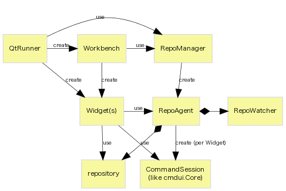

# Repository Access and Command Execution (Planned)

**This feature is UNDER DEVELOPMENT.**

## Overview

* introduces a wrapper to repository object, called `RepoAgent`

* `RepoManager` manages life-cycle of `RepoAgent` and its filesystem monitor.
* `RepoAgent` owns `repository` object instead of extending it to thgrepository.
* `RepoAgent` will receive all command requests and run them in sequence.
  It may use cmdserver process to address thread issues.
* While running commands, `RepoAgent` disables filesystem monitor. This will resolve
  temporary `LookupError` while rebasing, qrefresh, etc.

## TODOs

short-term:

1. eliminate backward dependencies to `run` module from widgets (DONE)
1. redesign command API so that it can receive per-repository object (DONE)
1. have Workbench and RepoWidget use new classes (WIP)
1. implement stubs for new classes (WIP)
1. implement queued command runner by using cmdui.Core (WIP)
1. implement per-repository command queue (WIP)
1. have cmdui (optionally) accept RepoAgent as command runner
1. have RepoWidget use new command runner
1. pass stubs to all widgets
1. have all widgets run commands via RepoAgent

long-term:

* how to call workbench from sub dialogs?
* drop `thgrepository` extension
* use command server via `QProcess`
* better control of `refreshWctx()`
* ...

## Issues to Consider

file-system monitoring:

* #812, #1305, #1426, #1469, #1758 - RevlogError on strip, rebase, collapse, etc.
* #1594, #2604 - error after qpop
* #1783 - thg keeps a ref to a folderrepo for too long ?
* #2470 - hg push in command line (to SVN with hgsubversion)

repo/ui object:

* #588 - Unified diff view doesn't work well with EOL extension
  → [discussion](http://thread.gmane.org/gmane.comp.version-control.mercurial.tortoisehg.user/3341/focus=3345)
* #2208 - Support --config argument for 'thg workbench'

thread/process:

* #1507 - Stop button for pull that hangs
* #1661 - "abort: Interrupted system" call during push with subrepos
* #2071 - crash when pushing with mercurial_keyring
* #2614 - `util.hgexecutable()` returns wrong path
* 074fd0fde0b6 - worker.py of Mercurial 2.6 only works in main thread

## See Also

* [[PATCH 0 of 7 RFC] rough idea to address instability of async command execution and polling](https://groups.google.com/d/msg/thg-dev/r2cWqYDg4iQ/JVg12dP1O1AJ)