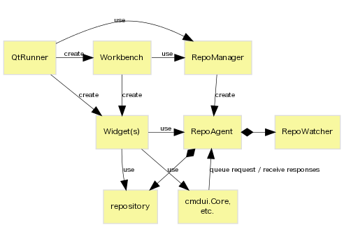

# Repository Access and Command Execution

**This feature is UNDER DEVELOPMENT.**

[TOC]

## Overview

* `RepoManager` manages life-cycle of `RepoAgent` and its filesystem monitor.
* `RepoAgent` owns `repository` object instead of extending it to thgrepository.
* `RepoAgent` (and `CmdAgent`) will receive all command requests and run them
  in sequence.
* Provides consistent *unicode APIs*

## Command Execution

`RepoAgent` and its backend, `CmdAgent`, provide the same APIs to execute
Mercurial commands asynchronously.

`runCommand(cmdline)` or `runCommandSequence([cmdline, ...])` start or queue
the specified command and return new `CmdSession` object which will provide
notification signals.

Example:

~~~~{.py}
    def __init__(self, ...):
        ...
        self._cmdsession = cmdcore.nullCmdSession()

    def runUpdate(self):
        if not self._cmdsession.isFinished():
            return  # command still running
        cmdline = hglib.buildcmdargs('update', rev='.')
        self._cmdsession = sess = self._repoagent.runCommand(cmdline, self)
        sess.commandFinished.connect(self._onUpdateFinished)

    @pyqtSlot(int)
    def _onUpdateFinished(self, ret):
        if ret != 0:
            cmdui.errorMessageBox(self._cmdsession, self)
...
~~~~

The relation between `CmdAgent` and `CmdSession` is similar to the one
between `QNetworkAccessManager` and `QNetworkReply`.

### Executors

**CmdThread** (default < 3.1)

* lightweight and feature-rich
* cannot abort on I/O stall, #1507
* has several thread issues like #1661 or #2071

**CmdProc**

* high overhead (especially on Windows)
* ~~cannot abort *safely* (`kill -KILL` or `TerminateProcess` is used)~~
  (possible by win32ill extension)
* cannot terminate if `hg` is a batch file
* no interactive prompt
* ~~no progress and `ui.label`~~

**CmdServer** (default in 3.1)

* need to manage server process
* http://mercurial.selenic.com/wiki/CommandServer#Known_issues

### GUI

* `CmdControlDialog` for one-shot command with configurable parameters  
  (e.g. "archive", "clone", "update")
* `CmdSessionDialog` for log window of started command  
  (e.g. "verify", hidden log window of "quickop")
* `CmdSessionControlWidget` to implement dialog which needs unusual handling  
  (e.g. "compress", "import", "rebase")
* bare `LogWidget` and `ThgStatusBar` for others  
  (e.g. "commit", "sync")

* TODO: add utility for tag-like dialogs?

## Change History

In 2.9:

* introduce `RepoManager` and stub for `RepoAgent`
* redesign command API of `tortoisehg.hgqt.run`
* \#1783 - thg keeps a ref to a folderrepo for too long ?
* \#1571 - disable filesystem monitor while command running

In 2.10:

* new per-repository command runner which manages busy state and command queue
* `cmdui.Runner` and `cmdui.Dialog` has been replaced by the new command runner
* run web server in separate process

In 2.11:

* replace `cmdui.Widget` by new command runner
* remove manual busy counting, `increment/decrementBusyCount()`
* almost all widgets receive `RepoAgent` in place of raw `repo`
* move shortname and displayname to `RepoAgent`
* pass `ui` to `cmdcore.CmdAgent` so that it can read user configuration
* \#2208 - Support --config argument for 'thg workbench'
* obtain `RepoAgent` of subrepo through main's

In 3.0:

* extract reusable `QtUi` from thread.py
* add experimental command server client which uses `QProcess`

In 3.1 (unreleased):

* missing `ui.error` label in command server
* \#3343 - Blackbox extension not working when using hg from within TortoiseHg
* \#1661 - "abort: Interrupted system" call during push with subrepos
* \#2071 - crash when pushing with mercurial_keyring
* \#2614 - `util.hgexecutable()` returns wrong path
* 074fd0fde0b6 - worker.py of Mercurial 2.6 only works in main thread
* \#3370 - Workbench UI getting dispresponsive on certain operations
* \#484 - Can't update to any revision (SVN subrepo)
* \#3637 - Redirect hook stdout, stderr to Output log
* \#3670 - WindowsError 6 in pipe decode/encode filter

### TODOs

short-term (in 3.1?):

1. update document of command APIs (in separate Wiki page?)
1. bundlerepo (or unionrepo) and `--hidden` flag
1. add API to capture raw command output without emitting `outputReceived()`
   (for email preview, revset query, export to clipboard, etc.)

long-term:

* remove global cache of `thgrepository` instances
* remove `CmdThread` and redesign `ui.error` and `dispatch` wrapper
* keep dirstate/wctx up-to-date by RepoAgent?
* better control of `refreshWctx()`
* provide read/write config API
* reload root ui object when global setting is changed?
* how to call workbench from sub dialogs?
* drop `thgrepository` extension
* ...

## Issues to Consider

file-system monitoring:

* \#812, #1305, #1426, #1469, #1758, #2565 - RevlogError on strip,
  rebase, collapse, etc.
* \#1594, #2604 - error after qpop
* \#2470 - hg push in command line (to SVN with hgsubversion)

repo/ui object:

* \#588 - Unified diff view doesn't work well with EOL extension
  → [discussion](http://thread.gmane.org/gmane.comp.version-control.mercurial.tortoisehg.user/3341/focus=3345)

hidden, union repo:

* \#2552 - compare branch from different repos
* \#3735 - obosoleted changeset appears as "Child:" field unexpectedly

thread/process:

* \#1507 - Stop button for pull that hangs
* \#3381 - Locked folders/files on Windows (again)

direct command call:

* InitDialog calls `hg.repository(..., create=1)`
* \#1347 - Add support for pre-<command> and post-<command> hooks
* \#2217 - Adding files to source control in the separate thread

workingctx:

* \#3621 - Shelve tool does not always know about added/removed files

child to workbench:

* \#2354 - "Folder History" in revision browser does nothing

unicode:

* \#3246 - better handling of UnicodeEncodeError of command-line parameters

## See Also

* [[PATCH 0 of 7 RFC] rough idea to address instability of async command execution and polling](https://groups.google.com/d/msg/thg-dev/r2cWqYDg4iQ/JVg12dP1O1AJ)
